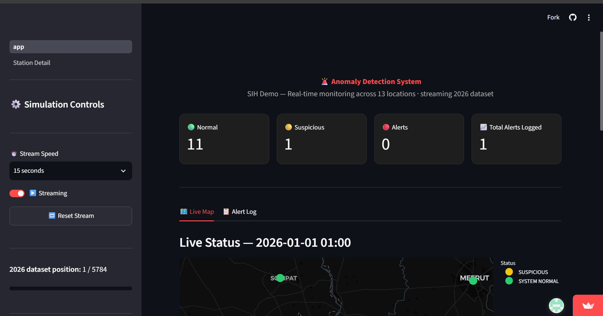
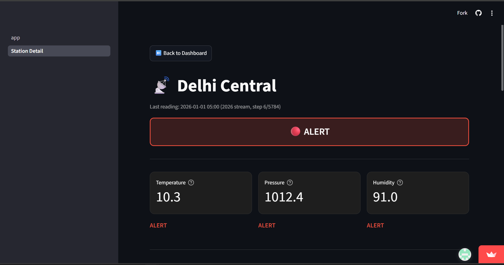
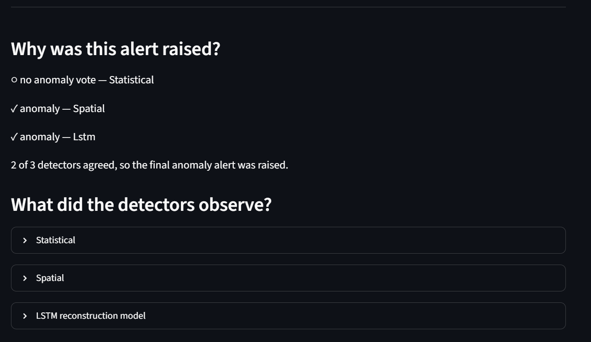
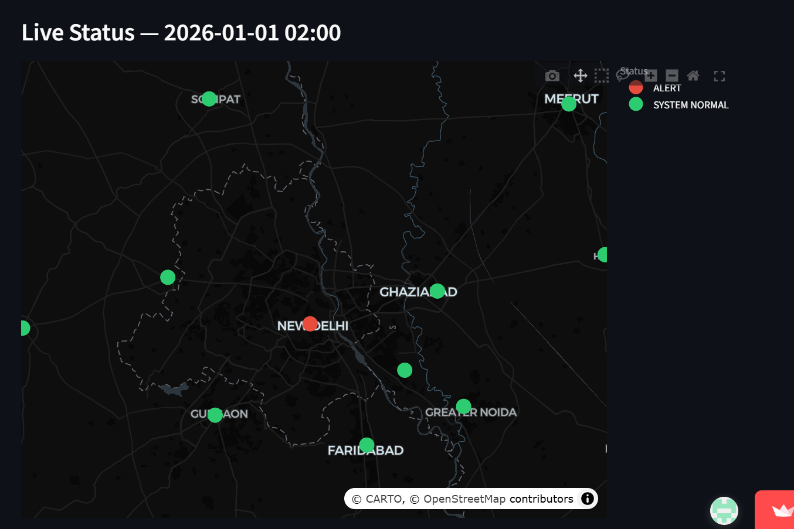
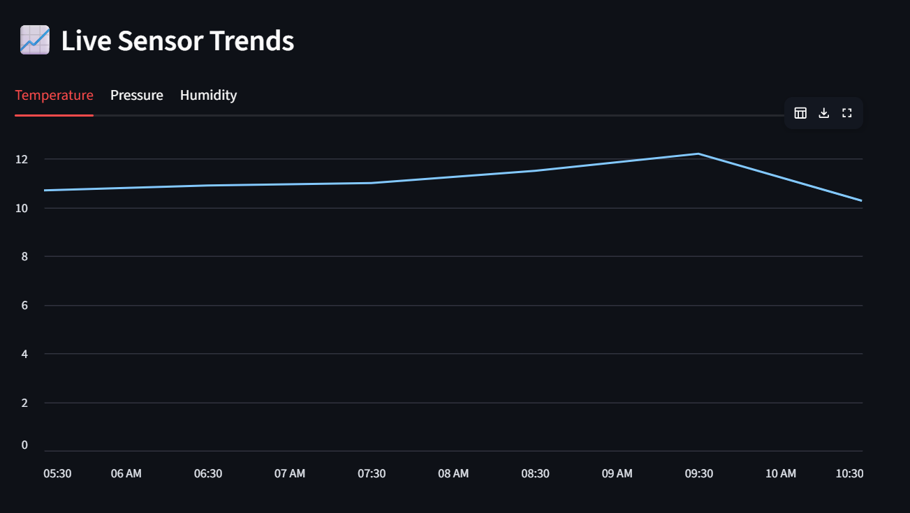

# SkyGuard AI

**Intelligent Anomaly Detection for Automatic Weather Stations (AWS)**

SkyGuard AI is a multi-detector anomaly detection system developed for **Smart India Hackathon 2026 — Problem #73**. It analyzes weather station observations and combines statistical, spatial, and multivariate temporal evidence to identify potentially faulty or anomalous sensor readings.

The system is designed to help distinguish genuine meteorological variation from sensor faults and abnormal observations while providing evidence that can be inspected by an operator.

## Live Demo

**SkyGuard AI:**
https://skyguardai-sih.streamlit.app/

The deployed prototype provides an interactive Streamlit dashboard for exploring weather stations, anomaly alerts, detector evidence, and explainability information.

---

## Table of Contents

* [Project Information](#project-information)
* [Problem Statement](#problem-statement)
* [Proposed Solution](#proposed-solution)
* [Key Features](#key-features)
* [Technology Stack](#technology-stack)
* [System Architecture](#system-architecture)
* [Detection Approach](#detection-approach)

  * [Statistical Detector](#statistical-detector)
  * [Spatial Detector](#spatial-detector)
  * [LSTM Autoencoder](#lstm-autoencoder)
  * [Detector Fusion](#detector-fusion)
* [Explainability and Diagnosis](#explainability-and-diagnosis)
* [Anomaly Types](#anomaly-types)
* [Evaluation](#evaluation)
* [Repository Structure](#repository-structure)
* [Installation](#installation)
* [Running the Dashboard](#running-the-dashboard)
* [Running Evaluation Pipelines](#running-evaluation-pipelines)
* [Deployment](#deployment)
* [Expected Outputs](#expected-outputs)
* [Example Use Case](#example-use-case)
* [Screenshots](#screenshots)
* [Documentation](#documentation)
* [Future Scope](#future-scope)
* [Final Presentation](#final-presentation)
* [Team](#team)

---

## Project Information

| Field             | Details                                                                              |
| ----------------- | ------------------------------------------------------------------------------------ |
| **Project Title** | SkyGuard AI – Intelligent Real-Time Anomaly Detection for Automatic Weather Stations |
| **PS ID**         | SIH26073                                                                             |
| **PS Title**      | AI/ML-Based Intelligent Anomaly Detection for Automatic Weather Stations (AWS)       |
| **Category**      | Software                                                                             |
| **Theme**         | Disaster Management                                                                  |
| **Department**    | India Meteorological Department (IMD)                                                |
| **Organization**  | Ministry of Earth Sciences (MoES)                                                    |

---

## Problem Statement

Automatic Weather Stations continuously collect atmospheric observations that support weather forecasting, climate monitoring, disaster management, aviation, agriculture, and scientific research.

However, AWS observations can contain anomalies caused by:

* Sensor malfunction
* Communication failures
* Calibration drift
* Power fluctuations
* Harsh environmental conditions
* Data corruption
* Other abnormal sensor behaviour

Traditional threshold-based quality-control methods may be insufficient for detecting complex, multivariate, spatially inconsistent, or subtle temporal anomalies.

An erroneous observation can propagate into downstream forecasting and decision-making systems.

SkyGuard addresses this problem by analyzing:

* **Temperature (°C)**
* **Atmospheric Pressure (hPa)**
* **Relative Humidity (%)**

The system combines multiple sources of evidence to identify suspicious observations while reducing dependence on any single detection method.

---

## Proposed Solution

SkyGuard uses three complementary anomaly detection approaches.

### 1. Statistical Detection

The statistical detector identifies observations that deviate from expected temporal and historical behaviour.

It considers:

* Range violations
* Rate-of-change anomalies
* Rolling z-score deviations
* Persistence behaviour
* Historical baseline deviations

### 2. Spatial Consistency Detection

The spatial detector compares a weather station with nearby stations at the same timestamp.

It uses neighbouring observations and **Inverse Distance Weighting (IDW)** to estimate an expected value for a station. A large difference between the observed value and the spatially expected value can indicate a localized sensor anomaly.

### 3. Multivariate Temporal Detection

The LSTM Autoencoder models normal temporal behaviour across temperature, pressure, and humidity.

The model reconstructs temporal windows and uses reconstruction error to identify observations that differ from learned normal patterns.

These three detector outputs are combined through a fusion layer before the final anomaly decision is presented to the dashboard.

---

## Key Features

* Multi-detector AWS anomaly detection
* Statistical anomaly detection
* Spatial consistency analysis across nearby stations
* Multivariate temporal anomaly detection
* LSTM Autoencoder-based reconstruction scoring
* Detector fusion using complementary evidence
* 2-of-3 detector agreement for final anomaly alerts
* Observation-level anomaly scoring
* Event-level anomaly evaluation
* Severity-oriented anomaly outputs
* Detector-specific evidence
* Explainable anomaly contributors
* Operational diagnosis and suggested checks
* Station-level anomaly visualization
* Interactive Streamlit dashboard
* Controlled synthetic anomaly generation
* Ground-truth-based evaluation
* Chronological calibration and evaluation separation
* Frozen detector artifacts for reproducible inference

---

## Technology Stack

| Area                     | Technology                       |
| ------------------------ | -------------------------------- |
| **Frontend / Dashboard** | Streamlit                        |
| **Programming Language** | Python                           |
| **Data Processing**      | Pandas, NumPy, PyArrow           |
| **Machine Learning**     | Scikit-learn                     |
| **Temporal Model**       | LSTM Autoencoder                 |
| **Explainability**       | SHAP                             |
| **Spatial Analysis**     | Inverse Distance Weighting (IDW) |
| **Data Formats**         | CSV, Parquet                     |
| **Visualization**        | Plotly, Matplotlib               |
| **Model Artifacts**      | Pickle                           |
| **Deployment**           | Streamlit Community Cloud        |

---

## System Architecture

SkyGuard is organized around complementary detector evidence rather than relying on a single anomaly detection technique.

```text
Historical Weather Data
        |
        v
Calibration / Training
        |
        v
   Frozen Detector
      Artifacts
        |
        +-------------------+
        |                   |
        v                   v
2026 Evaluation Data    Streamlit App
        |
        v
  Detector Pipeline
        |
   +----+----+----+
   |         |    |
   v         v    v
Statistical Spatial LSTM
 Detector   Detector Autoencoder
   |         |    |
   +---------+----+
             |
             v
       Fusion Layer
         (2-of-3)
             |
             v
     Anomaly Decision
             |
             v
 Evidence / Explainability
             |
             v
        Diagnosis
             |
             v
         Dashboard
```

For a more detailed architecture description, see [`docs/architecture.md`](docs/architecture.md).

---

## Detection Approach

### Statistical Detector

The statistical detector evaluates whether observations are unusual relative to historical and temporal expectations.

Signals include:

* Range anomalies
* Rate-of-change anomalies
* Rolling z-score deviations
* Persistence anomalies
* Historical baseline deviations

The detector also groups individual signals into evidence families such as range, rate-of-change, level, and persistence.

---

### Spatial Detector

The spatial detector evaluates whether a station is consistent with nearby stations.

For example:

```text
Station A: 35°C

Nearby stations:
B: 22°C
C: 23°C
D: 21°C

Expected spatial value ≈ 22°C

Residual ≈ 35 - 22 = 13°C

Large residual → Possible anomaly
```

The detector uses **Inverse Distance Weighting (IDW)** to estimate expected station values from neighbouring stations.

The spatial approach is particularly useful for identifying localized station faults that may not be obvious from the station's own historical data.

It can also distinguish localized anomalies from coordinated regional changes: if all nearby stations change together, the spatial relationship can remain consistent.

---

### LSTM Autoencoder

The temporal detector learns normal multivariate behaviour across:

```text
Temperature
Pressure
Humidity
```

Conceptually:

```text
Normal Time-Series Windows
            |
            v
       LSTM Encoder
            |
            v
        Latent State
            |
            v
       LSTM Decoder
            |
            v
    Reconstructed Window
            |
            v
    Reconstruction Error
            |
            v
       Anomaly Score
```

Normal sequences should generally have lower reconstruction error, while unusual temporal patterns can produce larger errors.

The detector respects station boundaries, avoids bridging large temporal gaps, and follows chronological training and calibration.

---

### Detector Fusion

The three detectors provide complementary evidence.

The current fusion policy uses **2-of-3 detector agreement**:

```text
Statistical ──┐
              │
Spatial ──────┼──> Fusion ──> Final Alert
              │      2/3
LSTM ─────────┘
```

An anomaly alert is raised when at least two of the three detector votes agree.

This makes the final decision less dependent on a single detector and allows the different detection approaches to compensate for one another.

The fusion decision is deterministic.

---

## Explainability and Diagnosis

SkyGuard provides supporting information so that an anomaly alert is not presented as an unexplained binary result.

For an alert, the system can expose:

### Decision

The dashboard can show:

* Which detectors voted for the anomaly
* How many detectors agreed
* The required agreement
* Final alert state
* Severity information

The explanation reflects the actual fusion decision. Explainability does not modify detector votes or the final alert.

### Detector Evidence

The system can surface evidence from the individual detectors, including:

* Statistical checks and triggered signals
* Spatial expected values and residuals
* Number of retained neighbouring stations
* Temporal reconstruction error
* Observed versus reconstructed values

### Model Explanation

Where available, SHAP-based model explanations can show which timestep/variable inputs contributed to the reconstruction anomaly score.

These contributions explain the model score; they are **not causal explanations** and should not be interpreted as probabilities.

### Operational Diagnosis

The diagnosis layer provides evidence-based operational hypotheses and suggested checks where the available evidence supports them.

A diagnosis is not treated as proof of a physical sensor failure.

---

## Anomaly Types

SkyGuard's synthetic evaluation framework supports controlled injection of several anomaly patterns:

| Anomaly Type    | Description                                 |
| --------------- | ------------------------------------------- |
| **Spike**       | Sudden extreme deviation                    |
| **Offset**      | Sustained shift from expected values        |
| **Drift**       | Gradual movement away from normal behaviour |
| **Stuck**       | Sensor becomes constant                     |
| **Rate Change** | Abnormally rapid temporal change            |
| **Noise**       | Increased random variation                  |
| **Dropout**     | Missing or invalid readings                 |

Synthetic anomaly labels are used for **offline evaluation only**. They are not used to train or recalibrate the detector during normal inference.

---

## Evaluation

SkyGuard uses a controlled synthetic benchmark to evaluate detector behaviour against known ground truth.

```text
Historical Dataset
        |
        v
Calibrate Detector
        |
        v
Freeze Calibration State
        |
        v
Unseen Evaluation Dataset
        |
        v
Inject Known Anomalies
        |
        v
Run Detector
        |
        v
Compare with Ground Truth
        |
        v
Calculate Performance
```

This chronological separation helps prevent evaluation leakage.

### Observation-Level Metrics

Evaluation includes:

* Precision
* Recall
* F1 Score
* False Positive Rate
* True Positives
* False Positives
* False Negatives
* True Negatives

### Event-Level Evaluation

Many sensor anomalies span multiple observations.

An anomaly event is considered detected when at least one anomalous observation within that event is flagged.

This provides an operational perspective in which detecting an anomaly event can be more important than detecting every individual anomalous reading.

### Detector Complementarity

The evaluation framework also examines how the different detectors behave individually and in combination, including whether one detector identifies anomalies missed by the others.

---

## Repository Structure

```text
SKYGUARD/
├── README.md
├── SUBMISSION_GUIDE.md
├── .gitignore
├── pyproject.toml
├── requirements.txt
│
├── artifacts/
│   └── skyguard_v1/
│       ├── fusion_config.json
│       ├── lstm.pkl
│       ├── spatial.pkl
│       └── statistical.pkl
│
├── docs/
│   ├── architecture.md
│   ├── CODEBASE_REFERENCE.md
│   └── DEVELOPER_GUIDE.md
│
├── frontend/
│   └── streamlit/
│       ├── app.py
│       ├── pages/
│       │   └── 1_Station_Detail.py
│       └── utils/
│           ├── __init__.py
│           ├── detector.py
│           ├── explainability.py
│           ├── simulator.py
│           └── styles.py
│
├── notebooks/
│   ├── data_validation.ipynb
│   └── lstm_autoencoder_exploration.ipynb
│
├── results/
│   └── prototype/
│       └── skyguard_demo_2026_results.parquet
│
├── src/
│   └── skyguard/
│       ├── config/
│       ├── data/
│       ├── detectors/
│       ├── diagnostics/
│       ├── evaluation/
│       ├── explainability/
│       ├── fusion/
│       └── simulation/
│
├── submission/
│   ├── DEMO.md
│   ├── PRESENTATION.md
│   └── SIH26073.pdf
│
└── tests/
    ├── test_diagnosis.py
    └── test_explainability.py
```

### What goes where?

| Item                          | Location                       |
| ----------------------------- | ------------------------------ |
| Core source code              | `src/skyguard/`                |
| Detector implementations      | `src/skyguard/detectors/`      |
| Fusion engine                 | `src/skyguard/fusion/`         |
| Explainability                | `src/skyguard/explainability/` |
| Diagnosis                     | `src/skyguard/diagnostics/`    |
| Evaluation pipelines          | `src/skyguard/evaluation/`     |
| Synthetic anomaly generation  | `src/skyguard/simulation/`     |
| Streamlit dashboard           | `frontend/streamlit/`          |
| Model/configuration artifacts | `artifacts/`                   |
| Evaluation results            | `results/`                     |
| Technical documentation       | `docs/`                        |
| Exploratory notebooks         | `notebooks/`                   |
| Final presentation            | `submission/`                  |
| Project screenshots           | `assets/screenshots/`          |

---

## Installation

Clone the repository and create a Python environment:

```bash
git clone <YOUR_REPOSITORY_URL>
cd <YOUR_PROJECT_FOLDER>

python -m venv .venv
source .venv/bin/activate
```

On Windows:

```powershell
python -m venv .venv
.venv\Scripts\activate
```

Install dependencies:

```bash
pip install -r requirements.txt
```

The project also includes `pyproject.toml` for package configuration.

---

## Running the Dashboard

From the repository root:

```bash
streamlit run frontend/streamlit/app.py
```

The dashboard provides an interactive interface for exploring:

* Weather stations
* Anomaly alerts
* Detector evidence
* Station-level behaviour
* Explainability information
* Operational diagnosis

The deployed prototype is available at:

**https://skyguardai-sih.streamlit.app/**

---

## Running Evaluation Pipelines

Individual detector evaluations can be run with:

```bash
python src/skyguard/evaluation/evaluate_statistical.py
```

```bash
python src/skyguard/evaluation/evaluate_spatial.py
```

The LSTM Autoencoder evaluator supports:

```bash
python src/skyguard/evaluation/evaluate_lstm_autoencoder.py --mode full
```

```bash
python src/skyguard/evaluation/evaluate_lstm_autoencoder.py --mode score
```

```bash
python src/skyguard/evaluation/evaluate_lstm_autoencoder.py --mode analyze
```

Combined detector evaluation:

```bash
python src/skyguard/evaluation/evaluate_combined.py
```

Explainability evaluation:

```bash
python src/skyguard/evaluation/evaluate_explainability.py
```

Diagnosis evaluation:

```bash
python src/skyguard/evaluation/evaluate_diagnosis.py
```

Evaluation outputs are written to the corresponding locations under `results/`.

---

## Deployment

SkyGuard's dashboard is deployed using Streamlit Community Cloud.

```text
GitHub Repository
        |
        v
Streamlit Community Cloud
        |
        v
frontend/streamlit/app.py
        |
        v
SkyGuard Dashboard
```

The prototype uses prepared detector artifacts and precomputed results where appropriate. The deployed dashboard does not retrain the models or run the complete evaluation pipeline at application startup.

### Live deployment

**https://skyguardai-sih.streamlit.app/**

---

## Expected Outputs

SkyGuard is designed to provide:

* Anomaly alerts
* Anomaly scores
* Severity indicators
* Detector-specific evidence
* Statistical anomaly signals
* Spatial consistency information
* Temporal reconstruction information
* Explainable anomaly contributors
* Operational diagnosis where supported by available evidence
* Station-level anomaly visualization
* Sensor-health-oriented information

Automated correction or imputation of anomalous values is considered future work rather than a current core output.

---

## Example Use Case

Consider an Automatic Weather Station that suddenly reports:

```text
Temperature: 55°C
Humidity:    Extremely high
Pressure:    Abnormal variation
```

while nearby stations continue reporting normal observations.

SkyGuard can combine:

* Temporal and statistical evidence
* Spatial inconsistency with neighbouring stations
* Multivariate temporal reconstruction error

to determine whether the observation should be treated as a potential anomaly.

The dashboard can then present the supporting detector evidence and available explainability information so that an operator can investigate the observation.

---

## Screenshots

### Dashboard Overview



### Station Detail — Alert Detection



### Alert Explanation and 2-of-3 Detector Fusion



### Live Map with Anomaly Alert



### Live Sensor Trends


---

## Documentation

Additional technical documentation is available under `docs/`:

* [`docs/architecture.md`](docs/architecture.md) — System architecture and data flow
* [`docs/CODEBASE_REFERENCE.md`](docs/CODEBASE_REFERENCE.md) — Detector and codebase reference
* [`docs/DEVELOPER_GUIDE.md`](docs/DEVELOPER_GUIDE.md) — Development, evaluation, and workflow guidance
* [`SUBMISSION_GUIDE.md`](SUBMISSION_GUIDE.md) — SIH submission checklist

---

## Future Scope

Potential extensions include:

* Live AWS data-stream integration
* Direct integration with meteorological observation networks
* Dedicated missing-data and communication-error detection
* Sensor degradation forecasting
* Predictive maintenance recommendations
* Automatic anomalous-value correction and imputation
* Edge AI deployment on low-power hardware
* More advanced learned fusion/meta-models
* Adaptive station-specific calibration
* Large-scale deployment across national AWS networks
* Continuous model monitoring and recalibration
* Integration with operational weather-quality-control systems

---

## Final Presentation

The final SIH presentation is included directly in the repository:

**[`submission/SIH26073.pdf`](submission/SIH26073.pdf)**

A Google Drive copy is also available:

**[View Final Presentation on Google Drive](https://drive.google.com/file/d/1HPyD7hL8wk6Nfy7JHs8eByT6g-z5m8tJ/view?usp=sharing)**

Additional information is available in [`submission/PRESENTATION.md`](submission/PRESENTATION.md).

---

## Team

### Darth Coders

| Team Member          | University ID |
| -------------------- | ------------- |
| **Aaryan Aaloke**    | 2024UCI8070   |
| **Ayush Soni**       | 2024UCI8063   |
| **Kashika Yadav**    | 2024UCI8039   |
| **Mohammed Hammad**  | 2024UCI6516   |
| **Noman Ali Ansari** | 2024UCI8055   |
| **Pratham**          | 2024UCI8062   |

---

**SkyGuard AI — Building trustworthy weather observations through intelligent anomaly detection.**
